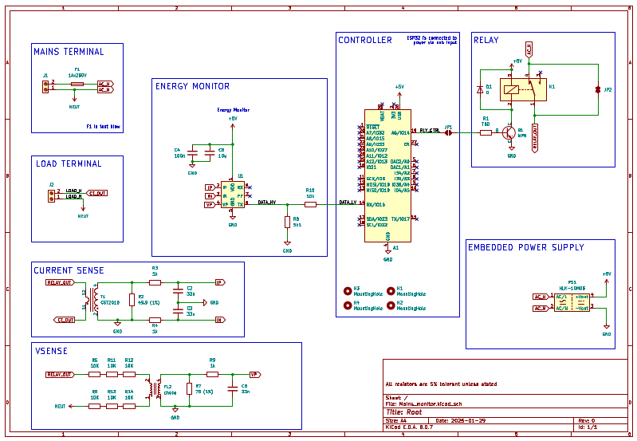
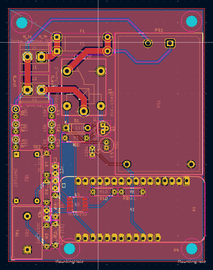
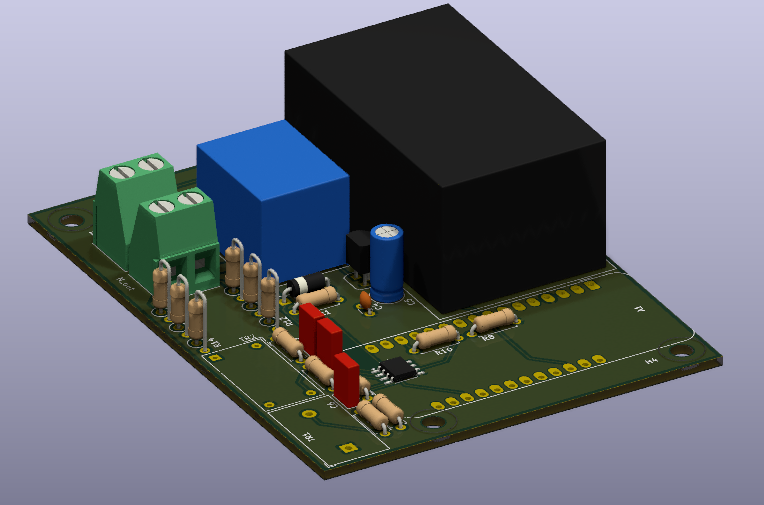

# Energy Meeter

An esp32-powered smart plug and online dashboard.

## Features

- Online dashboard
- WiFi communication
- Capable of analyzing the power consumption of an arbitrary load
- 5A current rating

## Hardware

### Board Revision A

Status: in review

This is the current board revision for the energy meeter. It's currently in review to ensure that it can safely handle high voltage.

#### Schematic

#### Board

#### Stack Up

## Software

### Networking and Dashboard

### Energy Monitor Library

- [HLW8032 energy monitor library](https://github.com/Energy-Meeter/HLW8032)