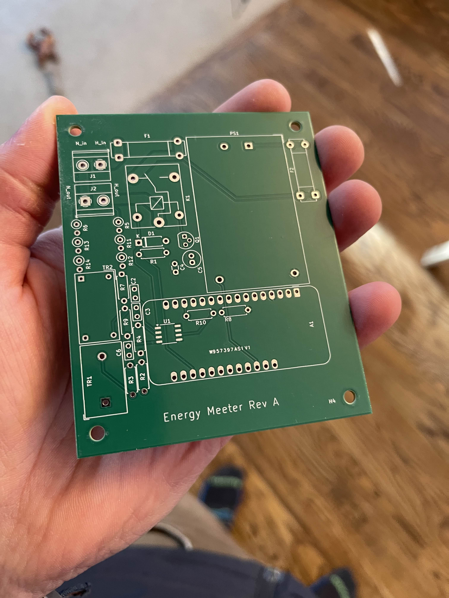

# Energy Meeter

An esp32-powered smart plug and online dashboard.

## Features

- Online dashboard
- WiFi communication
- Capable of analyzing the power consumption of an arbitrary load
- 5A current rating

## Hardware

### Board Revision A

Status: Testing

The current revision of the energy meeter. We just received it from PCBWay, and we're now in the process of assembling and validating it.

#### Schematic

#### Board

#### Stack Up

## Software

### Networking and Dashboard

### Energy Monitor Library

- [HLW8032 energy monitor library](https://github.com/Energy-Meeter/HLW8032)